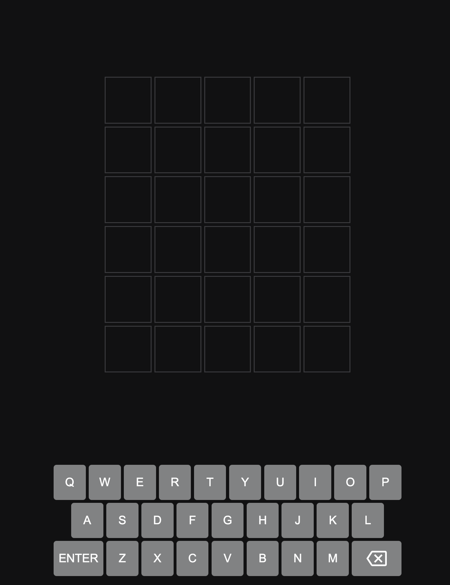
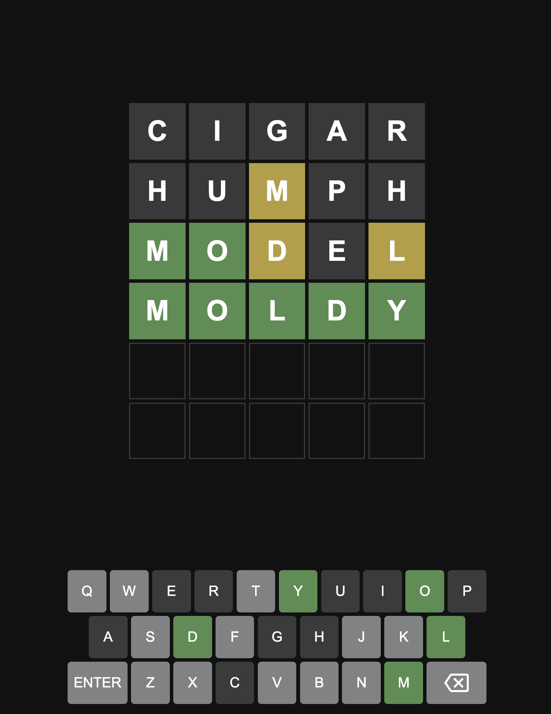

# Wordle Clone

This is a simple Wordle clone, a word-guessing game where players attempt to guess a hidden word within a limited number of tries. 

## How to Play

1. **Objective**: Guess the hidden word within 6 attempts.

2. **Guessing**: Enter a 5-letter word into the input field and submit your guess.

3. **Feedback**: After each guess, you'll receive feedback:
   - Green letters indicate correct letters in the correct positions.
   - Yellow letters indicate correct letters but in the wrong positions.
   - Gray letters indicate letters that are not in the word.

4. **Strategy**: Use feedback to refine your guesses and deduce the hidden word.

5. **Winning**: Guess the word correctly within the allotted attempts to win the game.

## Features

- Randomly generated hidden word.
- Intuitive user interface.
- Feedback mechanism to aid in guessing.
- Responsive design suitable for various screen sizes.

## Technologies Used

- HTML/CSS/JavaScript for front-end development.
- Vanilla JavaScript for game logic.
- Bootstrap for styling.

## How to Run

1. Clone this repository to your local machine.
2. Open `index.html` in your web browser.

## Demo

You can play a live demo of the game [here](#).

## Screenshots

## Credits

This project was inspired by the original Wordle game. Code was inspired by WebDevSimplified (https://www.youtube.com/watch?v=Wak7iN4JZzU&t=1260s)

## Contribution

Contributions are welcome! If you find any bugs or have suggestions for improvements, please open an issue or submit a pull request.

## License

This project is licensed under the MIT License - see the [LICENSE](LICENSE) file for details.